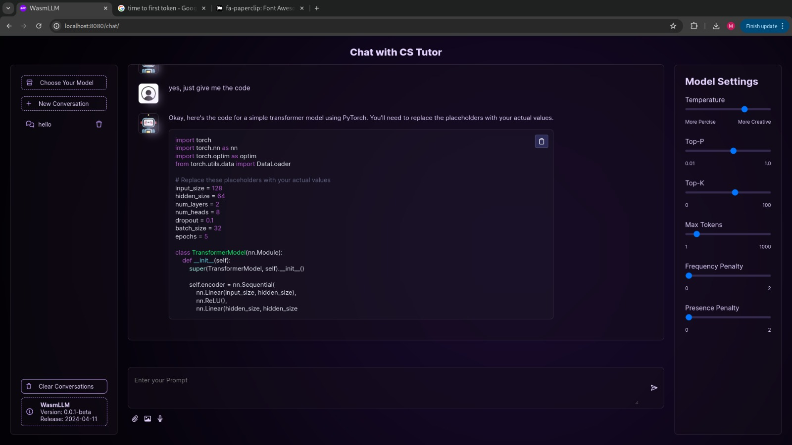

<!-- PROJECT SHIELDS -->
[![Contributors][contributors-shield]][contributors-url]
[![Forks][forks-shield]][forks-url]
[![Stargazers][stars-shield]][stars-url]
[![Issues][issues-shield]][issues-url]
[![LinkedIn][linkedin-shield]][linkedin-url]

<!-- PROJECT LOGO -->
 

<h3 align="center">WasmLLM Chat</h3>

  

<!--     <a href="https://github.com/youssef-mansor/RISC-V-Datapath-single-cycle-implementation">View Demo</a> -->
<!--     · -->
    <a href="https://github.com/youssef-mansor/RISC-V-Datapath-single-cycle-implementation/issues">Report Bug</a>
    ·
    <a href="https://github.com/youssef-mansor/RISC-V-Datapath-single-cycle-implementation/issues">Request Feature</a>
  

<!-- ABOUT THE PROJECT -->

## About The Project

In-Browser LLM inference and training platform: Decentralized, Fast, Secure, Requiring No ML Expertise!

## Prioritizing Your Privacy

WasmLLM ensures your data remains private by not using cloud or remote servers for storage. Both training and model operations occur directly within your browser.

## Features

### WasmLLM Hub
The WasmLLM Hub is a platform offering access to both in-house and user-provided pre-trained models that are ready for immediate use.

### Training Models
Experience the ease of model training:
- Start by navigating to the training section from the landing page.
- Upload your data.
- Set model paremeters.
- Train your model and track the training progress.

### Deploying & Sharing Models

We provide three options for deployment

- WasmLLM Hub: Upload and manage your model publicly or privately on the Hub for personal or shared use.
- Hugging Face: Deploy your model on Hugging Face to leverage its collaborative platform and gain wide exposure.
- Embedding in Websites: Embed your model in websites using iframes to integrate directly with user interfaces and enhance visitor interaction.

### Chat!
Now set back and let the conversation begin!

## Tech Stack
The project utilizes the following technologies:

<!-- MARKDOWN LINKS & IMAGES -->
[contributors-shield]: https://img.shields.io/github/contributors/youssef-mansor/RISC-V-Datapath-single-cycle-implementation.svg?style=for-the-badge
[contributors-url]: https://github.com/youssef-mansor/RISC-V-Datapath-single-cycle-implementation/graphs/contributors
[forks-shield]: https://img.shields.io/github/forks/youssef-mansor/RISC-V-Datapath-single-cycle-implementation.svg?style=for-the-badge
[forks-url]: https://github.com/youssef-mansor/RISC-V-Datapath-single-cycle-implementation/network/members
[stars-shield]: https://img.shields.io/github/stars/youssef-mansor/RISC-V-Datapath-single-cycle-implementation.svg?style=for-the-badge
[stars-url]: https://github.com/youssef-mansor/RISC-V-Datapath-single-cycle-implementation/stargazers
[issues-shield]: https://img.shields.io/github/issues/youssef-mansor/RISC-V-Datapath-single-cycle-implementation.svg?style=for-the-badge
[issues-url]: https://github.com/youssef-mansor/RISC-V-Datapath-single-cycle-implementation/issues
[license-shield]: https://img.shields.io/github/license/youssef-mansor/RISC-V-Datapath-single-cycle-implementation.svg?style=for-the-badge
[license-url]: https://github.com/youssef-mansor/RISC-V-Datapath-single-cycle-implementation/blob/main/LICENSE
[linkedin-shield]: https://img.shields.io/badge/-LinkedIn-black.svg?style=for-the-badge&logo=linkedin&colorB=555
[linkedin-url]: https://www.linkedin.com/in/youssef-m-86a690174/
[product-screenshot]: images/screenshot.png

